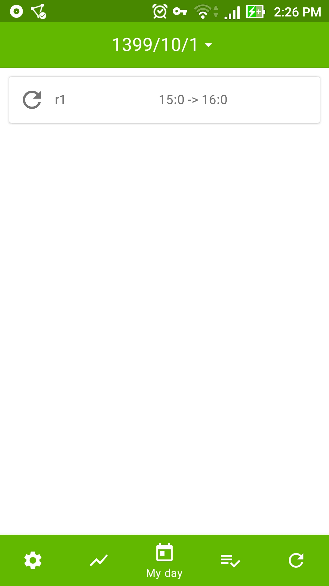
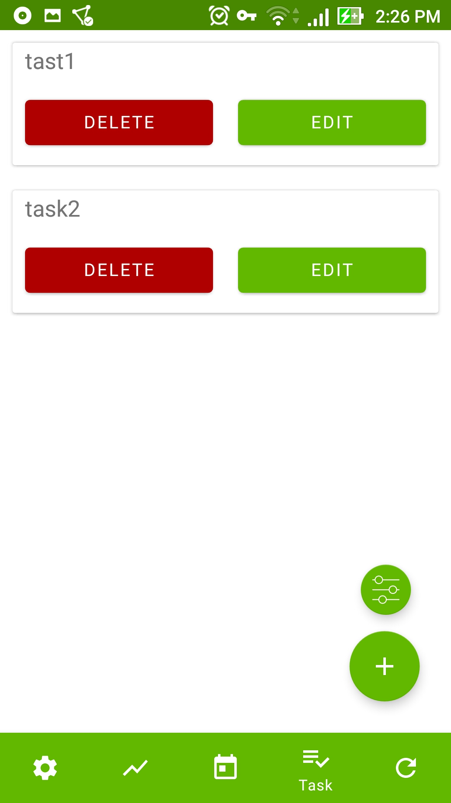
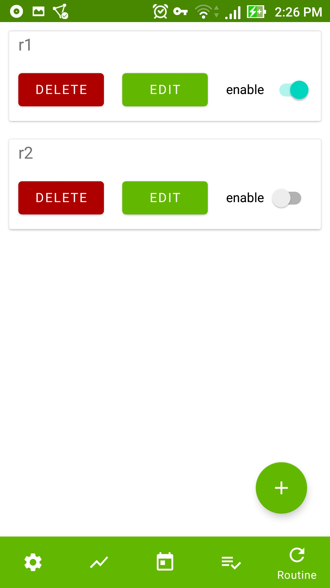
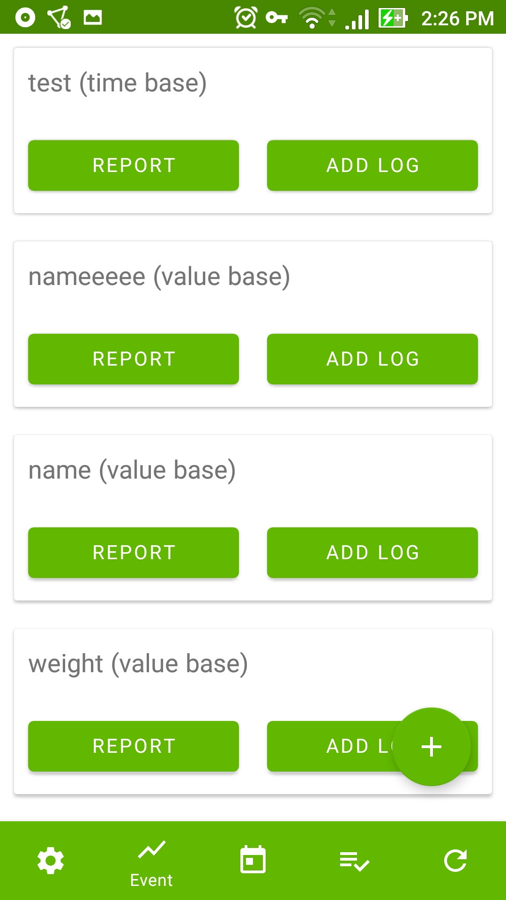
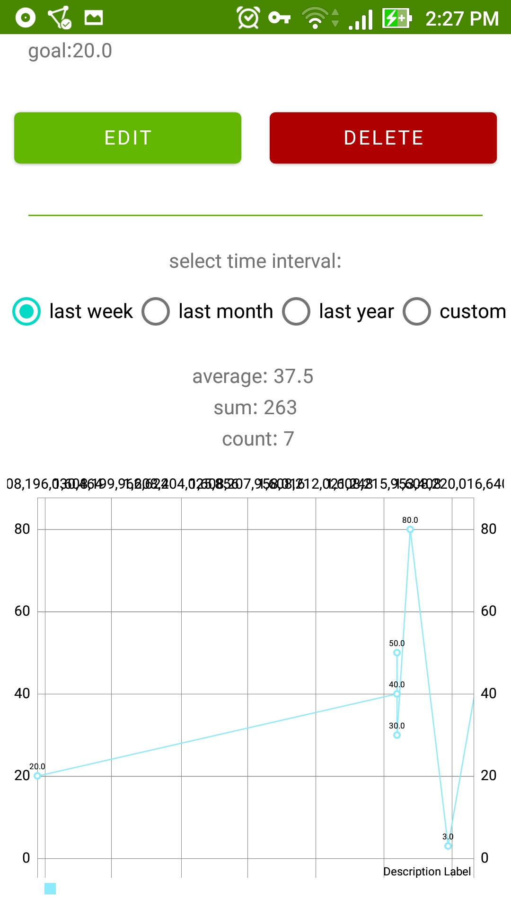
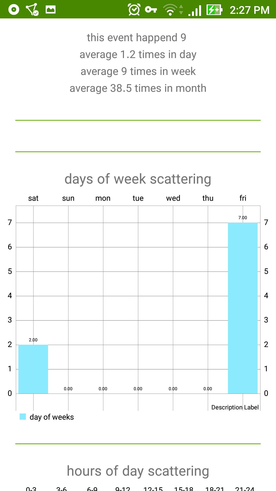

# LIME
Life is managable events (Android app for manage daily task and routines and monitor habits)

# DOCS
application concept: [google docs](https://docs.google.com/document/d/17KNgtW530fxoKOBY6AsuHTdixiUKtSi0c8BmAIQMb9E/edit?usp=sharing)

# SOME Screenshot

 

# TODO
you can help me in:
1. adding farsi language
2. tags
3. calandar mode in settings
4. design better ui|ux
5. more cool reports for habits
6. widgets
7. better logo 
8. new idea that make things better... 🙂